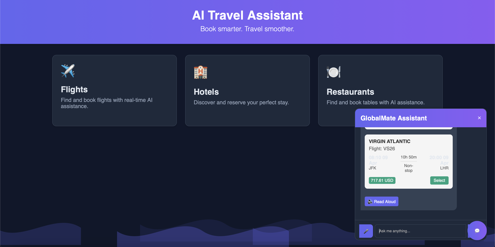

# devpost-fetch-ai-2025
Devpost Fetch AI Hackathon 2025

# GlobalMate - AI Travel Assistant 🌍

[](https://opensource.org/licenses/MIT) 


An AI-powered travel assistant built with Flask and Gemini Pro 1.5. Plan trips, find deals, and book experiences — all with a conversational AI agent.

## Features ✨

- ✈️ **Flights** – Real-time flight search and bookings
- 🏨 **Hotels** – Budget-aware lodging suggestions
- 🍽️ **Restaurants** – Top-rated local dining options
- 🌦️ **Weather** – Current weather insights
- 🔔 **Price Alerts** – Fetch.ai-powered hotel price tracking
- 💬 **Chat UI** – Gemini Pro 1.5 with speech and voice input

##  UI Preview 🖥️

> The UI uses emoji icons — no custom images used.



## 🚀 Installation

```bash
pip install -r requirements.txt
python app.py
```

##  Agent Registry

### Core Agents
| Agent Name | Address | Description | Endpoint |
|------------|---------|-------------|----------|
| `price-tracker` | `fetch162cu5xtcc7eqmt3fk7zdvhgqnhkhnly4lqwgy3` | Monitors hotel price drops | `POST /track` |
| `alert-bot` | `fetch1q9d4r0t5kjmv7zvsh4fs6nyh2jcv8jq5u6x7f8` | Sends wallet notifications | `POST /notify` |
| `data-validator` | `fetch1m3n5v9q0w8x2z4r6t8y1x3c5v7b9d0k2l4o6p` | Verifies API responses | `GET /validate` |

Agent Deployment

# Sample Agent Initialization
from uagents import Agent

price_tracker = Agent(
    name="price-tracker",
    seed="your_seed_phrase_here",
    endpoint=["http://your-server:8000/submit"]
)
